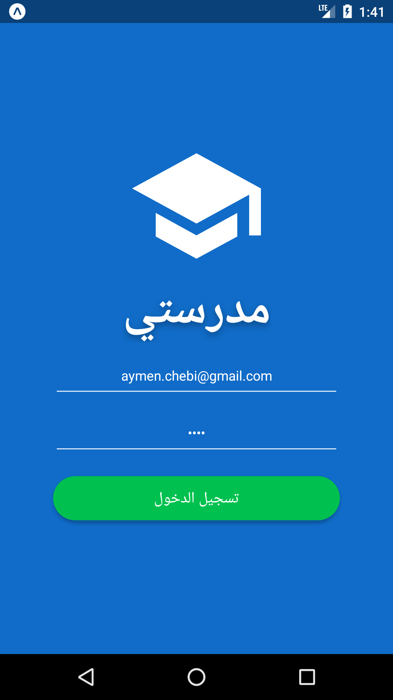
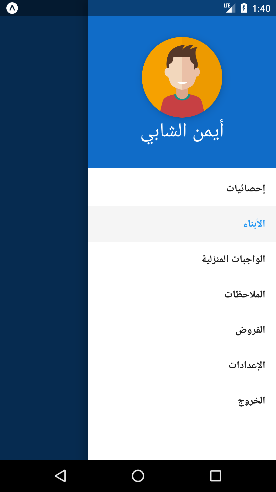

# Madrasati Mobile

Madarasti Mobile is the mobiel client for Madrasati Platform.
It enables parents to check on their children activity in their school.

## Table of Contents

* [Prerequisites](#prerequisites)
* [Installing](#installing)
* [Running](#running)
* [Built With](#built-with)
* [Todo](#todo)

## Prerequisites

Before we start make sure you have installed :

* Javascript Package Manager : NPM or Yarn
* Android/iOS Simulator along with required SDK or [Expo Mobile Client](https://expo.io/tools#client)
* [Madrasati Server](https://gitlab.com/benyaalaamir/madrasati) Along its dependencies

## Installing

* Configure and setup Madrasati Server on your Computer/Server
* Git Clone this repo &nbsp; : &nbsp; `git clone https://gitlab.com/madrasati/Madrasati-Mobile`
* cd to the project directory and &nbsp; `npm install` &nbsp; or &nbsp; `yarn install`
* Change &nbsp; `baseURL` in `/app/utils/env.js` &nbsp; to your Madrasati ip address name or &nbsp; `10.0.2.2` &nbsp; if running on simulator

## Running

* If using Android/iOS simulator, start it
* `npm start` &nbsp; or &nbsp; `yarn start`
* The App should start if you are using a simulator otherwise you should Scan the QR Code with the Expo Mobile App.

## Built With

* [React Native](https://github.com/facebook/react-native) - A framework for building native apps with React.
* [Redux](https://github.com/reactjs/redux/) - A State container for JavaScript apps.
* [Expo SDK](https://expo.io/) - Expo SDK, a library that provides a wide variety of native APIs on iOS and Android
* [React Native Elements](https://github.com/react-native-training/react-native-elements) - For some ui elements
* [React Native Calendars](https://github.com/wix/react-native-calendars) - React Native Calendar Components
* [React Navigation](https://github.com/react-navigation/react-navigation) - Routing and navigation for your React Native apps
* [Redux Axios Middleware](https://github.com/svrcekmichal/redux-axios-middleware) - Redux middleware for fetching data with axios HTTP client

## Todo

* Implement more Madrasati Features :Exams calendars, Professor remarks, More information on Stats screen
* Push Notification on new Homework assignments
* Integrate JWT Authentification
